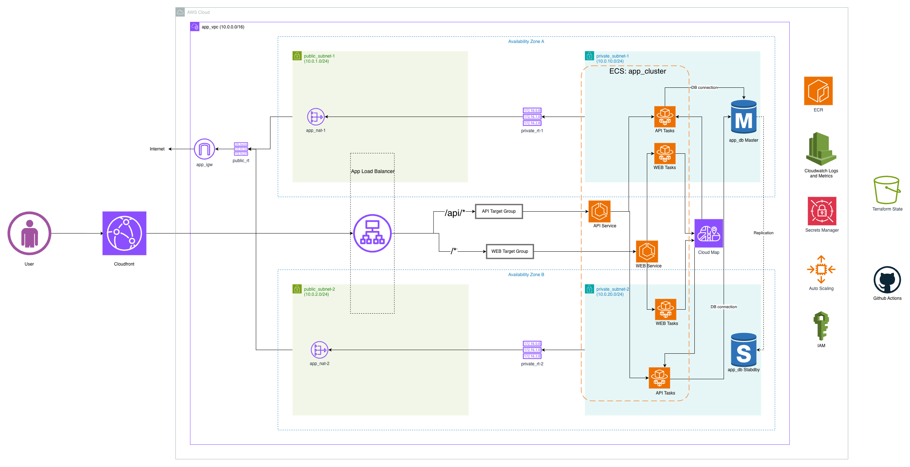

# Node.js 3-Tier App - AWS Infrastructure

This repo contains a fully automated, scalable, and secure 3-tier Node.js application deployed on AWS using Infrastructure as Code (OpenTofu) and GitHub Actions CI/CD.

The application overview is as follows

```
CloudFront → ALB → Web (ECS Fargate) → API (ECS Fargate) → RDS PostgreSQL
```

The AWS services include:
- Virtual Private Cloud (Multi-AZ)
- Application Load Balancer
- ECS Fargate (Web + API)
- RDS PostgreSQL (Multi-AZ)
- CloudFront CDN
- ECR (Container Registry)
- CloudWatch (Logs, Metrics, Dashboards, Alarms)
- Cloud Map (Service Discovery)
- Secrets Manager
- S3 (Terraform State)



This project contains **60 Terraform resources** across 14 configuration files and **6 GitHub Actions workflows**.

## Assumptions

- Have an AWS account with required IAM permissions.
- Have AWS CLI configured locally.
- Have OpenTofu installed (>= 1.5.0).
- GitHub repo has `AWS_ACCESS_KEY_ID`, `AWS_SECRET_ACCESS_KEY`, and `CLOUDFRONT_ORIGIN_SECRET` configured as secrets.
- A `production` environment is created in GitHub with required reviewers for deploy approval.

## About Setup

### VPC

> file: `terraform/vpc.tf`

- Custom VPC (`10.0.0.0/16`) with 2 public and 2 private subnets across two AZs.
- NAT Gateway in public subnet for outbound internet access from private subnets.
- Internet Gateway for public subnet routing.

### ALB

> file: `terraform/alb.tf`

- Application Load Balancer in public subnets, accepting traffic only from CloudFront (managed prefix list).
- Path-based routing: `/api/*` → API target group, `/*` → Web target group.
- Health checks on `/health` for both target groups.
- Origin secret header (`X-Custom-Origin-Secret`) validates requests are from CloudFront.

### ECS Fargate

> file: `terraform/ecs.tf`

- ECS cluster running Web and API services in private subnets.
- Rolling deployments with zero downtime (min 100%, max 200%).
- Auto-scaling on CPU utilization (target 70%) with max 6 tasks per service.
- Web containers communicate with API containers via Cloud Map service discovery (`api.nodeapp.local`).

### RDS

> file: `terraform/rds.tf`

- PostgreSQL Multi-AZ deployment for high availability.
- Automated daily backups with 7-day retention.
- DB credentials stored in Secrets Manager and injected into API tasks.

### CloudFront

> file: `terraform/cloudfront.tf`

- CDN distribution in front of the ALB.
- Static assets (`/stylesheets/*`, `/images/*`) cached with long TTL.
- Dynamic content forwarded with no caching.

### CloudWatch

> file: `terraform/cloudwatch.tf`

- Centralized log groups for Web and API containers.
- Dashboard with ALB, ECS, RDS, and CloudFront metrics.
- Alarms for high CPU (ECS), high connections (RDS), and 5xx errors (ALB).

### Service Discovery

> file: `terraform/service_discovery.tf`

- AWS Cloud Map private DNS namespace (`nodeapp.local`).
- API service registered for internal discovery by Web containers.
- Eliminates need for Web → ALB → API path for internal communication.

## CI/CD Pipelines

### PR Validation (triggered on pull requests)

| Workflow | Path Filter | Checks |
|---|---|---|
| `test-web.yml` | `web/**` | ESLint → npm audit → Hadolint → Docker build (tests inside) |
| `test-api.yml` | `api/**` | ESLint → npm audit → Hadolint → Docker build (tests inside) |
| `test-terraform.yml` | `terraform/**` | fmt → validate → plan |

### Deploy (triggered on push to master)

| Workflow | Path Filter | Steps |
|---|---|---|
| `deploy-web.yml` | `web/**` | Build + push to ECR → Deploy to ECS (requires approval) |
| `deploy-api.yml` | `api/**` | Build + push to ECR → Deploy to ECS (requires approval) |
| `deploy-terraform.yml` | manual dispatch | Plan → Apply (requires approval) |

Deploy jobs require approval via GitHub's `production` environment protection rules.

## Setup

### Prerequisites

- Install and configure AWS CLI
  ```bash
  aws configure
  ```
- Install OpenTofu
  ```bash
  brew install opentofu
  ```

### Deploy Infrastructure

```bash
cd terraform
tofu init
tofu plan
tofu apply
```

Full apply takes around 15-20 minutes (RDS Multi-AZ is the bottleneck).

### Build and Push Container Images

```bash
# Login to ECR
aws ecr get-login-password --region us-east-1 | docker login --username AWS --password-stdin <account-id>.dkr.ecr.us-east-1.amazonaws.com

# Build and push
docker build --platform linux/amd64 -t <account-id>.dkr.ecr.us-east-1.amazonaws.com/nodeapp-web:latest ./web
docker push <account-id>.dkr.ecr.us-east-1.amazonaws.com/nodeapp-web:latest

docker build --platform linux/amd64 -t <account-id>.dkr.ecr.us-east-1.amazonaws.com/nodeapp-api:latest ./api
docker push <account-id>.dkr.ecr.us-east-1.amazonaws.com/nodeapp-api:latest
```

### Force ECS Redeployment

```bash
aws ecs update-service --cluster nodeapp-cluster --service nodeapp-web --force-new-deployment --region us-east-1
aws ecs update-service --cluster nodeapp-cluster --service nodeapp-api --force-new-deployment --region us-east-1
```

## Operations

Scripts are available in the `operations/` directory for runtime management.

```bash
cd operations

# ECS - start/stop/scale
./ecs.sh start              # Start all services
./ecs.sh stop               # Stop all services
./ecs.sh scale all 4        # Scale all to 4
./web_ecs.sh scale 3        # Scale web only
./api_ecs.sh stop           # Stop API only

# RDS - backup/list
./rds.sh backup             # Create manual snapshot
./rds.sh list               # List all snapshots
```

## Tear Down Infrastructure

Before running `tofu destroy`, the following manual steps are required:

1. **Disable RDS deletion protection**
   ```bash
   aws rds modify-db-instance --db-instance-identifier nodeapp-db --no-deletion-protection --region us-east-1
   ```

2. **Delete ECR images** (repos have `force_delete = false`)
   ```bash
   aws ecr delete-repository --repository-name nodeapp-web --force --region us-east-1
   aws ecr delete-repository --repository-name nodeapp-api --force --region us-east-1
   ```

3. **Force delete Secrets Manager secret** (otherwise scheduled for 7-30 day deletion window)
   ```bash
   aws secretsmanager delete-secret --secret-id nodeapp/db-credentials --force-delete-without-recovery --region us-east-1
   ```

4. **Run destroy**
   ```bash
   cd terraform
   tofu destroy
   ```

> **Note:** RDS will create a final snapshot (`nodeapp-db-final-snapshot`) before deletion. Delete it manually if not needed to avoid storage costs.
